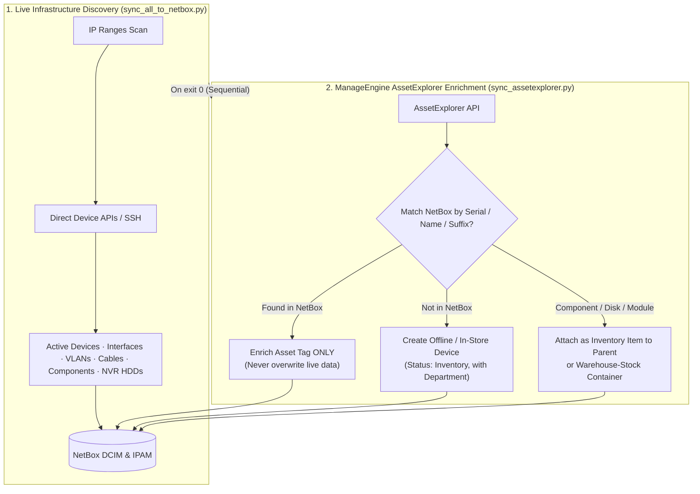

<div align="center">

# 🛰️ NetBox Infrastructure Sync

**One Python tool that scans your entire infrastructure and keeps NetBox as the always-accurate source of truth.**


Servers · Storage · SAN & LAN switches · Firewalls · Wireless · NVRs & Hard Drives · Cameras · ManageEngine AssetExplorer inventory enrichment — devices, interfaces, VLANs, IPAM, cables, and hardware inventory.

🇬🇧 **English below** · مستندات **فارسی** در انتها 🇮🇷

</div>

---

## 📚 Table of Contents

- [Overview](#-overview)
- [Architecture & Workflow](#-architecture--workflow)
- [What gets scanned (Discovery)](#-what-gets-scanned-discovery)
- [ManageEngine AssetExplorer Sync](#-manageengine-assetexplorer-sync)
- [What gets created in NetBox](#-what-gets-created-in-netbox)
- [Getting started](#-getting-started)
- [Configuration reference](#-configuration-reference)
- [Running & scheduling (Automated Pipeline)](#%EF%B8%8F-running--scheduling-automated-pipeline)
- [Tests](#-tests)
- [Safety guarantees](#%EF%B8%8F-safety-guarantees)
- [Project layout](#%EF%B8%8F-project-layout)
- [مستندات فارسی](#-مستندات-فارسی)

---

## 🎯 Overview

Point the tool at your IP ranges (CIDR notation) and it identifies every device by its vendor-specific API or CLI, then reconciles NetBox to match reality — creating, updating, and (after repeated misses) marking devices offline. A secondary ManageEngine sync enriches Asset Tags and imports offline/in-store equipment.

| | |
|---|---|
| 🔌 **Ten live device families** | Native protocols: Redfish, XML API, SSH CLI, REST, digest ISAPI/CGI/LAPI |
| 🧩 **Component-level inventory** | CPUs, RAM, disks, PSUs, NICs, HBAs, SFPs, FC ports, NVR hard drives |
| 🏢 **ManageEngine Integration** | Asset Tag sync on serial match; imports offline & warehouse inventory |
| 🕸️ **Topology-aware** | CDP/LLDP inter-switch cables, camera↔switch cables from MAC tables, broadcast-domain VLAN groups |
| 🛡️ **Careful by design** | Never overwrites automation data from ME, never deletes devices on flap, manages marker-owned objects only |

---

## 🔄 Architecture & Workflow



---

## 🔍 What gets scanned (Discovery)

Every family is **opt-in**: set its `*_RANGES` in `.env`; leave empty to disable it entirely.

| Family | Devices | Protocol | Key endpoints / commands |
|---|---|---|---|
| 🖥️ **Servers** | HPE ProLiant DL/ML, Gen8–Gen11 | Redfish (iLO 4/5) | `/redfish/v1/Systems`, `/Chassis`, `/Storage` + SmartStorage fallback (Gen9) |
| 💾 **Storage** | HPE MSA 2040/2050/2060 | XML API (HTTPS, legacy-TLS capable) | `show disks`, `show disk-parameters`, `show controllers`, `show power-supplies`, `show frus` |
| 🧵 **SAN switches** | Brocade / HPE B-Series | SSH CLI (Fabric OS) | `switchshow`, `version`, `nsshow`, `nscamshow`, `sfpshow` |
| 🌐 **LAN switches** | Cisco Catalyst (IOS / IOS-XE) | SSH via netmiko | `show version`, `show inventory`, `show interfaces status`, `show vlan brief`, `show interfaces trunk`, `show cdp/lldp neighbors detail`, `show mac address-table`, `show ip interface brief`, `show vtp status` |
| 🔥 **Firewalls** | FortiGate (FortiOS 6/7) | REST session + SSH extras | `POST /logincheck`, `/monitor/system/*`, `/cmdb/system/interface`, HA monitors, VIPs/IP pools; SSH: `diagnose lldp neighbor-summary`, `diagnose sys transceiver list` |
| 📡 **Wireless (Ruckus)** | ZoneDirector ZD1200-class | SSH interactive shell | `show sysinfo`, `show ap all`, `show ap <mac>` (AP serials), `show wlan all` |
| 📶 **Wireless (Ubiquiti)** | UniFi OS consoles (UDM/CloudKey/Server) | HTTPS session API | `POST /api/login`, `/api/self/sites`, per-site `stat/device`, `rest/wlanconf`, `rest/networkconf` |
| 🎥 **NVRs (Hikvision)** | DS-96xx/77xx NVRs | HTTP digest (ISAPI) | `/ISAPI/System/deviceInfo`, `ContentMgmt/InputProxy/channels(+status)`, `ContentMgmt/Storage/hdd` (NVR disks), per-channel proxied `deviceInfo` |
| 🎥 **NVRs (Dahua)** | NVR4X/NVR6xx-class | HTTP digest (CGI) | `magicBox.cgi` (system info), `configManager.cgi RemoteDevice` + `ChannelTitle` |
| 🎥 **NVRs (Uniview)** | NVR30x-class | HTTP digest (LAPI) | `/LAPI/V1.0/System/DeviceInfo`, `Channels/System/ChannelDetailInfos`, `DeviceInfos` |

---

## 🏢 ManageEngine AssetExplorer Sync

ManageEngine AssetExplorer (`sync_assetexplorer.py`) runs as a secondary data source:

1. **Source of Truth Protection**: The live automation is the absolute source of truth for online devices. ManageEngine **never** overwrites device names, serials, interfaces, IPAM, or live hardware attributes.
2. **Asset Tag Enrichment**: For existing devices in NetBox, matches by Serial Number (with Name and Camera Suffix fallback) and enriches **only the Asset Tag**.
3. **Offline & In-Store Stock**: Assets in ME that do not exist in NetBox are created with status `Inventory` (or `Decommissioning` for Expired) along with their **Department** and **Location**.
4. **Inventory Item Sync**: Components (`Power Module`, `HARD-Hardware`, `HARD-CCTV`, `NM Module`) are matched to their parent devices and synced as NetBox Inventory Items (or placed in a `Warehouse-Stock-<Site>` container device if unattached).

---

## 📦 What gets created in NetBox

### Devices

| Source | NetBox role | Identity | Notes |
|---|---|---|---|
| Server | `Server` | serial | BMC IP, model, BIOS, CPU/RAM/disk summaries, power state |
| Storage | `Storage` | serial | model, firmware, health, disk/capacity summaries |
| SAN switch | `SAN Switch` | serial / WWN | model, Fabric OS, port count |
| Cisco switch | `Switch` | serial | IOS version, port count |
| FortiGate | `Firewall` | serial (cluster = primary) | HA role/peers; HA pair merges into **one** device |
| Ruckus ZD | `Wireless Controller` | serial | HA pairs merge via `RUCKUS_HA_MAP` |
| UniFi console | `Wireless Controller` | console UUID | per-site AP/WLAN aggregation |
| APs (Ruckus + UniFi) | `Access Point` | **MAC** (`wap_mac`) / Serial | Serial collected via `show ap <mac>` (Ruckus) or derived from MAC (UniFi) |
| NVRs (3 vendors) | `NVR` | serial | `nvr_*` fields; installed physical HDDs synced as inventory items |
| **Cameras** | `Camera` | **serial** | `cam_*` fields, `cam_nvr` parent link, real MAC when available |
| ME In-Store Assets | Respective role | serial | Status `Inventory`, Department custom field, ME Asset ID |

### Custom fields

All 69 `*_ip` / `*_enabled` / `ae_*` / model / firmware / count fields are **auto-created at sync start** (`dcim.device`, `ui_visible=if-set`) and normalized at the end of every run.

---

## 🚀 Getting started

```bash
# 1. Setup virtual environment
python3 -m venv .venv
source .venv/bin/activate

# 2. Install dependencies
pip install -r requirements.txt

# 3. Configure environment
cp .env.example .env     # fill in your values
```

---

## 🧾 Configuration reference

| Variable | Required | Default | Purpose |
|---|---|---|---|
| `NETBOX_URL` / `NETBOX_TOKEN` | ✅ | — | NetBox API endpoint and token |
| `NETBOX_VERIFY_TLS` | ❌ | `true` | Set `false` for self-signed NetBox certs |
| **Live Discovery** | | | |
| `REDFISH_USER` / `REDFISH_PASS` | ✅ | — | iLO credentials |
| `STORAGE_USER` / `STORAGE_PASS` | ✅ | — | MSA credentials |
| `SWITCH_USER` / `SWITCH_PASS` | ✅ | — | Brocade SSH |
| `CISCO_USER` / `CISCO_PASS` | when ranged | — | SSH credentials |
| `FORTIGATE_USER` / `FORTIGATE_PASS` | when ranged | — | FortiGate admin |
| `RUCKUS_USER` / `RUCKUS_PASS` | when ranged | — | Ruckus SSH |
| `UNIFI_USER` / `UNIFI_PASS` | when ranged | — | UniFi local admin |
| `HIKVISION_USER` / `HIKVISION_PASS` | when ranged | — | Hikvision ISAPI digest |
| `DAHUA_USER` / `DAHUA_PASS` | when ranged | — | Dahua CGI digest |
| `UNV_USER` / `UNV_PASS` | when ranged | — | Uniview LAPI digest |
| **ManageEngine AssetExplorer** | | | |
| `AE_URL` | when using ME | — | e.g. `https://172.31.5.155` |
| `AE_API_KEY` | when using ME | — | Technician API key |
| **Scan ranges (core)** | | | |
| `BMC_RANGES` / `STORAGE_RANGES` / `SAN_RANGES` | ✅ | — | CIDR networks |
| `CISCO_RANGES` / `FORTIGATE_RANGES` / `RUCKUS_RANGES` / `UNIFI_RANGES` | ❌ | *(off)* | CIDR networks |
| `HIKVISION_RANGES` / `DAHUA_RANGES` / `UNV_RANGES` | ❌ | *(off)* | CIDR networks |

---

## ⏱️ Running & scheduling (Automated Pipeline)

### Manual runs

```bash
# Run live discovery only:
python sync_all_to_netbox.py

# Run ManageEngine sync only:
python sync_assetexplorer.py

# Wipe all devices & cables cleanly (for fresh sync):
python wipe_all_devices.py
```

### Automated daily pipeline (`run_daily_sync.sh`)

The included `run_daily_sync.sh` script coordinates the complete pipeline:
1. Executes `sync_all_to_netbox.py` and logs to `logs/main-YYYY-MM-DD.log`.
2. On success (exit code 0), immediately executes `sync_assetexplorer.py` and logs to `logs/ae-YYYY-MM-DD.log`.
3. If discovery fails, ManageEngine sync is safely skipped.

Schedule it in cron:

```cron
# Run daily pipeline at midnight
0 0 * * * /home/sina/netbox-redfish/run_daily_sync.sh

# Rotate logs older than 30 days
0 1 * * * find /home/sina/netbox-redfish/logs -name "*.log" -mtime +30 -delete
```

---

## ✅ Tests

```bash
pip install -r requirements-dev.txt
python -m pytest tests/
```

288 tests, all offline — fixtures captured from real devices and APIs, plus NetBox reconciliation against in-memory fakes.

---

## 🛡️ Safety guarantees

- **Source of truth separation**: Live automation data is never overwritten by ManageEngine.
- **Never deletes devices**: Offline devices are marked offline / inventory, never deleted.
- **Never touches manual data**: Only objects managed by the sync markers are updated.
- **Strict idempotency**: Repeated runs perform zero unnecessary writes and produce zero duplicates.
- **Collision & stale serial protection**: Ambiguous matches or cross-named serials fall back to safe name matching with clear warnings.

---

## 🗂️ Project layout

```
netbox_sync/
├── main.py                  # Entry: config validation, lockfile, exit codes
├── config.py                # .env loading, ranges, validation, logging
├── scanner.py               # Thread-pooled probing of all device families
├── report.py                # Failure categorization and scan summary generator
├── sync.py                  # Orchestration: live reconciliation, sweeps, cabling, HDDs
├── assetexplorer_sync.py    # ManageEngine AssetExplorer sync (tags, offline stock, items)
├── netbox.py                # Device/inventory/custom-field helpers
├── ipam.py                  # Prefixes, host IPs, NAT + services
├── models.py                # Vendor model alias maps
├── utils.py                 # Range expansion, port checks, naming helpers
└── collectors/
    ├── redfish.py           # HPE servers
    ├── msa.py               # HPE MSA storage
    ├── brocade.py           # SAN switches
    ├── cisco.py             # Catalyst switches
    ├── fortigate.py         # Firewalls
    ├── ruckus.py            # Ruckus ZD & APs (serial collection)
    ├── unifi.py             # UniFi consoles & APs
    ├── hikvision.py         # Hikvision NVRs, HDDs & cameras
    ├── dahua.py             # Dahua NVRs & cameras
    ├── unv.py               # Uniview NVRs & cameras
    └── assetexplorer.py     # ManageEngine API collector & normalizer

sync_all_to_netbox.py        # CLI entry point for live discovery
sync_assetexplorer.py        # CLI entry point for ManageEngine sync
run_daily_sync.sh            # Production sequential daily wrapper
wipe_all_devices.py          # Fast inventory cleanup utility
```

---
---

<div dir="rtl">

# 📘 مستندات فارسی

## معماری و نحوه کارکرد

این پروژه شامل دو بخش هماهنگ و مستقل است:

1. **اتوماسیون اسکن زنده (`sync_all_to_netbox.py`)**:
   - اسکن رنج‌های شبکه و جمع‌آوری اطلاعات مستقیم از ۱۰ خانواده دستگاه (سرورها، استوریج، سوییچ‌های LAN و SAN، فایروال، وایرلس، NVR و دوربین‌ها).
   - مرجع اصلی و قطعی داده‌های سخت‌افزاری و وضعیت زنده شبکه.
   - کشف هارد دیسک‌های فیزیکی NVRها و ثبت به عنوان Inventory Item.
   - استخراج سریال نامبر اکسس پوینت‌های Ruckus و UniFi.

2. **همگام‌سازی با ManageEngine AssetExplorer (`sync_assetexplorer.py`)**:
   - تطبیق دستگاه‌های موجود در نت‌باکس با AssetExplorer از طریق سریال‌نامبر (و نام در صورت لزوم).
   - **فقط به‌روزرسانی Asset Tag** برای دستگاه‌های آنلاین (بدون بازنویسی اطلاعات کشف‌شده توسط اتوماسیون).
   - ورود تجهیزات آفلاین، انبار و غیرقابل اسکن با وضعیت `Inventory` و ثبت فیلد `Department`.
   - همگام‌سازی قطعات سخت‌افزاری (پاور، هارد دیسک، ماژول) به عنوان Inventory Item.

## زمان‌بندی خودکار شبانه (`run_daily_sync.sh`)

اسکریپت `run_daily_sync.sh` هر شب در ساعت ۰۰:۰۰ به صورت خودکار:
1. ابتدا اسکن زنده را اجرا کرده و لاگ آن را در `logs/main-YYYY-MM-DD.log` ذخیره می‌کند.
2. پس از اتمام موفقیت‌آمیز (Exit Code 0)، همگام‌سازی ManageEngine را اجرا کرده و لاگ آن را در `logs/ae-YYYY-MM-DD.log` می‌نویسد.
3. در صورت بروز خطا در مرحله اول، مرحله دوم جهت حفظ یکپارچگی داده‌ها متوقف می‌شود.

```cron
0 0 * * * /home/sina/netbox-redfish/run_daily_sync.sh
```

</div>
