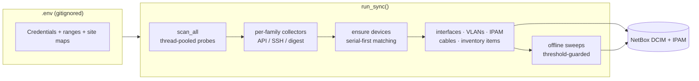

<div align="center">

# 🛰️ NetBox Infrastructure Sync

**One Python tool that scans your entire infrastructure and keeps NetBox as the always-accurate source of truth.**


Servers · Storage · SAN & LAN switches · Firewalls · Wireless · NVRs · **every camera** — devices, interfaces, VLANs, IPAM, cables, and hardware inventory.

🇬🇧 **English below** · مستندات **فارسی** در انتها 🇮🇷

</div>

---

## 📚 Table of Contents

- [Overview](#-overview)
- [What gets scanned](#-what-gets-scanned)
- [What gets created in NetBox](#-what-gets-created-in-netbox)
- [How it works](#%EF%B8%8F-how-it-works)
- [Getting started](#-getting-started)
- [Configuration reference](#-configuration-reference)
- [Running & scheduling](#%EF%B8%8F-running--scheduling)
- [Tests](#-tests)
- [Safety guarantees](#%EF%B8%8F-safety-guarantees)
- [Project layout](#%EF%B8%8F-project-layout)
- [مستندات فارسی](#-مستندات-فارسی)

---

## 🎯 Overview

Point the tool at your IP ranges (CIDR notation) and it identifies every device by its vendor-specific API or CLI, then reconciles NetBox to match reality — creating, updating, and (after repeated misses) marking devices offline. Run it from cron / systemd timer / Task Scheduler; every run is **idempotent** and safe to repeat.

| | |
|---|---|
| 🔌 **Ten device families** | each with its own native protocol — Redfish, XML API, SSH CLI, REST, digest ISAPI/CGI/LAPI |
| 🧩 **Component-level inventory** | CPUs, RAM, disks, PSUs, NICs, HBAs, SFPs, FC ports — matched by serial |
| 🕸️ **Topology-aware** | CDP/LLDP inter-switch cables, camera↔switch cables from MAC tables, VLAN groups derived from CDP broadcast domains |
| 🛡️ **Careful by design** | never deletes devices, never touches manual records, manages marker-owned objects only, offline threshold against flapping |

---

## 🔍 What gets scanned

Every family is **opt-in**: set its `*_RANGES` in `.env`; leave empty to disable it entirely (no scanning, no offline marking).

| Family | Devices | Protocol | Key endpoints / commands |
|---|---|---|---|
| 🖥️ **Servers** | HPE ProLiant DL/ML, Gen8–Gen11 | Redfish (iLO 4/5) | `/redfish/v1/Systems`, `/Chassis`, `/Storage` + SmartStorage fallback (Gen9) |
| 💾 **Storage** | HPE MSA 2040/2050/2060 | XML API (HTTPS, legacy-TLS capable) | `show disks`, `show disk-parameters`, `show controllers`, `show power-supplies`, `show frus` |
| 🧵 **SAN switches** | Brocade / HPE B-Series | SSH CLI (Fabric OS) | `switchshow`, `version`, `nsshow`, `nscamshow`, `sfpshow` |
| 🌐 **LAN switches** | Cisco Catalyst (IOS / IOS-XE) | SSH via netmiko | `show version`, `show inventory`, `show interfaces status`, `show vlan brief`, `show interfaces trunk`, `show cdp/lldp neighbors detail`, `show mac address-table`, `show ip interface brief`, `show vtp status` |
| 🔥 **Firewalls** | FortiGate (FortiOS 6/7) | REST session + SSH extras | `POST /logincheck`, `/monitor/system/*`, `/cmdb/system/interface`, HA monitors, VIPs/IP pools; SSH: `diagnose lldp neighbor-summary`, `diagnose sys transceiver list` |
| 📡 **Wireless (Ruckus)** | ZoneDirector ZD1200-class | SSH interactive shell | `show sysinfo`, `show ap all`, `show wlan all` |
| 📶 **Wireless (Ubiquiti)** | UniFi OS consoles (UDM/CloudKey/Server) | HTTPS session API | `POST /api/login`, `/api/self/sites`, per-site `stat/device`, `rest/wlanconf`, `rest/networkconf` |
| 🎥 **NVRs (Hikvision)** | DS-96xx/77xx NVRs | HTTP digest (ISAPI) | `/ISAPI/System/deviceInfo`, `ContentMgmt/InputProxy/channels(+status)`, per-channel proxied `deviceInfo` |
| 🎥 **NVRs (Dahua)** | NVR4X/NVR6xx-class | HTTP digest (CGI) | `magicBox.cgi` (system info), `configManager.cgi RemoteDevice` + `ChannelTitle` |
| 🎥 **NVRs (Uniview)** | NVR30x-class | HTTP digest (LAPI) | `/LAPI/V1.0/System/DeviceInfo`, `Channels/System/ChannelDetailInfos`, `DeviceInfos` |

<details>
<summary><b>🖥️ Servers — what exactly is collected</b></summary>

- **Identity:** serial, model (DL380 Gen9 → normalized aliases), BIOS version, power state, iLO/BMC IP
- **Components → NetBox inventory items:** CPUs (model, count, cores), DIMMs (size, serial), disks (model, serial, capacity, health — incl. Gen9 SmartStorage via `hpssacli`-style RAID data), PSUs, embedded + add-on NICs, HBAs
- **Matching:** serial-first; component items reconcile by serial/part so re-runs update instead of duplicating
</details>

<details>
<summary><b>💾 Storage (MSA) — what exactly is collected</b></summary>

- **Identity:** system name, vendor, model, serial, firmware bundle, overall health
- **Components:** every disk (slot, model, serial, size, health, temperature, SSD wear-life via `show disk-parameters`), power supplies & FRUs, controller management IPs
- **Compatibility:** works with modern TLS and legacy MSA firmware (`STORAGE_AUTH_HASH=md5` for very old units)
</details>

<details>
<summary><b>🧵 SAN switches (Brocade) — what exactly is collected</b></summary>

- **Identity:** hostname, chassis serial/WWN, model, Fabric OS version, port count
- **FC ports → interfaces:** port index, state, speed, and the **connected device WWN** per port (`nsshow`/`nscamshow`)
- **Optics:** SFP vendor/part/serial per port (`sfpshow`) → inventory items
</details>

<details>
<summary><b>🌐 LAN switches (Cisco) — what exactly is collected</b></summary>

- **Identity:** hostname, serial (stack members included), model, IOS/IOS-XE version
- **Interfaces:** every switchport with type (derived from speed/SFP), enabled state, description; SVIs as virtual interfaces
- **VLANs:** from `show vlan brief`; access/trunk linkage (untagged/tagged/native) per port; VLANs grouped into **broadcast-domain groups** (`BD1`, `BD2`…) derived from CDP topology
- **Topology:** CDP/LLDP neighbors → inter-switch **cables**; `show mac address-table` feeds the camera/AP **cabling** step
- **IPAM:** `show ip interface brief` → management IPs on their real interfaces
- **Inventory:** modules and SFPs from `show inventory`
</details>

<details>
<summary><b>🔥 Firewalls (FortiGate) — what exactly is collected</b></summary>

- **Identity:** serial, model, FortiOS version; **HA clusters merge into one device** (primary represents the pair, peers recorded)
- **Interfaces:** physical / VLAN / aggregate with lag & parent links; interface IPs → IPAM prefixes and gateway addresses; VLAN binding reuses the switches' existing VLANs (unique-match, MAC-table disambiguation)
- **NAT:** VIPs → IPAM addresses with native `nat_inside` links; IP pools → SNAT ranges; port-forwarded VIPs → NetBox **Services** (protocol + port)
- **Extras (SSH):** LLDP neighbors, transceiver inventory
</details>

<details>
<summary><b>📡📶 Wireless (Ruckus + UniFi) — what exactly is collected</b></summary>

- **Controllers:** serial / console UUID, model, firmware; Ruckus HA pairs merge via `RUCKUS_HA_MAP`
- **Access points:** every AP as its own device — identity by **MAC**, with name, model, IP, and controller/site linkage (name clashes disambiguated per site)
- **WLANs:** SSIDs from `show wlan all` / `rest/wlanconf`
</details>

<details>
<summary><b>🎥 NVRs & cameras — what exactly is collected</b></summary>

- **NVR identity (all three vendors):** serial, model, firmware, hostname — generic factory hostnames are IP-qualified (`hikvision-nvr-172-31-20-2`) so devices never collapse into one
- **Camera enumeration:**
  - **Hikvision:** channel list + online status, then each camera's proxied `deviceInfo` → model, serial, IP, firmware (503 rate-limits retried with backoff)
  - **Dahua:** `RemoteDevice` config → channel, IP, name, model; serials via `RemoteDeviceInfo` when the account has permission; per-camera MACs via `ChannelTitle-remote-deviceInfo`
  - **Uniview:** channel detail + device infos → name, IP, model, serial
- **Every camera becomes its own device** (role `Camera`, identity = serial) linked to its parent NVR via `cam_nvr`, with site, IP, MAC, channel and online state
- **Graceful degradation:** if camera enumeration is denied (restricted account), the NVR itself is still created — cameras fill in on a later permitted run
</details>

---

## 📦 What gets created in NetBox

### Devices

| Source | NetBox role | Identity | Notes |
|---|---|---|---|
| Server | `Server` | serial | BMC IP, model, BIOS, CPU/RAM/disk summaries, power state |
| Storage | `Storage` | serial | model, firmware, health, disk/capacity summaries |
| SAN switch | `SAN Switch` | serial / WWN | model, Fabric OS, port count |
| Cisco switch | `Switch` | serial | IOS version, port count |
| FortiGate | `Firewall` | serial (cluster = primary) | HA role/peers; HA pair merges into **one** device |
| Ruckus ZD | `Wireless Controller` | serial | HA pairs merge via `RUCKUS_HA_MAP` |
| UniFi console | `Wireless Controller` | console UUID | per-site AP/WLAN aggregation |
| APs (Ruckus + UniFi) | `Access Point` | **MAC** (`wap_mac`) | group/controller links; name-clash disambiguation per site |
| NVRs (3 vendors) | `NVR` | serial | `nvr_*` fields; offline sweeps are per-vendor (manufacturer-scoped) |
| **Cameras** | `Camera` | **serial** | `cam_*` fields, `cam_nvr` parent link, real MAC when available |

### Interfaces, VLANs, IPAM, cables

- **Cisco:** every switchport as an interface (type mapped from speed/SFP, enabled state, description); SVIs as virtual interfaces; access/trunk VLAN linkage; VLANs grouped into **CDP-derived broadcast-domain groups** (`BD1`, `BD2`…); CDP/LLDP **cables** between resolved interfaces.
- **Brocade:** FC ports as interfaces with connected WWNs.
- **FortiGate:** physical/VLAN/aggregate interfaces (lag/parent links), interface IPs → IPAM prefixes + gateway addresses, **VLAN binding resolved against the switches' existing VLANs**.
- **IPAM:** discovered prefixes nested under container parents from `SITE_IP_MAP`; management/primary IPs on the *real* carrier interface when identifiable.
- **NAT:** FortiGate VIPs → IPAM addresses with native `nat_inside` links; IP pools → SNAT ranges; port-forwarded VIPs → NetBox **Services** (protocol+port).
- **Camera → switch cables:** when Cisco is enabled, a camera with a known MAC is cabled to the switch port it's learned on (`netbox-sync: mac-table …`). Keep-on-absence: cables are never deleted when a MAC ages out — only moved on positive evidence.

### Custom fields

All 66 `*_ip` / `*_enabled` / model / firmware / count fields are **auto-created at sync start** (`dcim.device`, `ui_visible=if-set` — hidden until populated) and re-normalized at the end of every run. No manual NetBox setup required.

---

## ⚙️ How it works



**Matching:** devices are matched by serial first, then name+site+role — no duplicates across runs. Cameras and APs use serial / MAC identity respectively.

**Offline detection:** a device is marked offline only after `OFFLINE_THRESHOLD` (default 2) consecutive missed scans; the next successful scan flips it back to active. NVR families sweep per-vendor; camera sweeps never fire on unverifiable data (channel presence + serial evidence required).

**Sites:** `SITE_IP_MAP` (longest-prefix CIDR→site) first, then `SITE_KEYWORD_MAP` on the name, else the default site.

---

## 🚀 Getting started

```bash
pip install -r requirements.txt
cp .env.example .env     # fill in your values (see reference below)
python sync_all_to_netbox.py
```

Exit codes: `0` ok · `1` error · `130` Ctrl+C. A `netbox-sync.lock` file prevents overlapping runs (24 h stale-lock recovery).

---

## 🧾 Configuration reference

| Variable | Required | Default | Purpose |
|---|---|---|---|
| `NETBOX_URL` / `NETBOX_TOKEN` | ✅ | — | NetBox API endpoint and token |
| `NETBOX_VERIFY_TLS` | ❌ | `true` | Set `false` for self-signed NetBox certs |
| **Servers** | | | |
| `REDFISH_USER` / `REDFISH_PASS` | ✅ | — | iLO credentials |
| `REDFISH_PORT` | ❌ | `443` | |
| **Storage (MSA)** | | | |
| `STORAGE_USER` / `STORAGE_PASS` | ✅ | — | MSA credentials |
| `STORAGE_PORT` / `STORAGE_AUTH_HASH` | ❌ | `443` / `sha256` | hash = `md5` for very old firmware |
| **SAN switches** | | | |
| `SWITCH_USER` / `SWITCH_PASS` | ✅ | — | Brocade SSH |
| `SWITCH_PORT` / `SWITCH_STRICT_HOST_KEY` | ❌ | `22` / `false` | |
| **Cisco** | | | |
| `CISCO_USER` / `CISCO_PASS` | when ranged | — | SSH credentials |
| `CISCO_PORT` / `CISCO_RANGES` | ❌ | `22` / *(off)* | enables switches **and** camera cabling |
| `DEFAULT_CISCO_ROLE` | ❌ | `Switch` | |
| **FortiGate** | | | |
| `FORTIGATE_USER` / `FORTIGATE_PASS` | when ranged | — | admin (session auth via `/logincheck`) |
| `FORTIGATE_PORT` / `FORTIGATE_SSH_PORT` | ❌ | `443` / `22` | |
| **Ruckus** | | | |
| `RUCKUS_USER` / `RUCKUS_PASS` / `RUCKUS_PORT` | when ranged | — / — / `22` | SSH credentials |
| `RUCKUS_RANGES` / `RUCKUS_HA_MAP` | ❌ | *(off)* / — | HA pairs: `vip:primary,secondary;…` |
| `DEFAULT_RUCKUS_ROLE` / `DEFAULT_AP_ROLE` | ❌ | `Wireless Controller` / `Access Point` | |
| **UniFi** | | | |
| `UNIFI_USER` / `UNIFI_PASS` / `UNIFI_PORT` | when ranged | — / — / `8443` | dedicated **local** admin |
| `UNIFI_RANGES` / `DEFAULT_UNIFI_ROLE` | ❌ | *(off)* / `Wireless Controller` | |
| **NVRs** | | | |
| `HIKVISION_USER/PASS/PORT` | when ranged | — / — / `80` | ISAPI digest |
| `DAHUA_USER/PASS/PORT` | when ranged | — / — / `80` | CGI digest — needs **Monitor** right on *Camera → Remote Device* to enumerate cameras |
| `UNV_USER/PASS/PORT` | when ranged | — / — / `80` | LAPI digest |
| `*_RANGES` (each) | ❌ | *(off)* | per-family CIDR lists |
| `DEFAULT_*_ROLE` | ❌ | `NVR` | per NVR vendor |
| `DEFAULT_HIKVISION_CAMERA_ROLE` | ❌ | `Camera` | shared by all NVR vendors |
| **Scan ranges (core)** | | | |
| `BMC_RANGES` / `STORAGE_RANGES` / `SAN_RANGES` | ✅ | TEST-NET placeholders | replace with your networks |
| **Sites** | | | |
| `SITE_IP_MAP` | ❌ | — | `cidr:Site,…` — longest prefix wins, checked first |
| `SITE_KEYWORD_MAP` | ❌ | — | `keyword:Site,…` matched against device names |
| **Behavior** | | | |
| `SCAN_WORKERS` | ❌ | `20` | probe thread pool |
| `OFFLINE_THRESHOLD` | ❌ | `2` | consecutive misses before offline |
| `LOG_LEVEL` | ❌ | `INFO` | `DEBUG`/`INFO`/`WARN`/`ERROR` |
| `DEFAULT_SITE_NAME` / `DEFAULT_ROLE_NAME` / … | ❌ | — | fallback site/roles |

---

## ⏱️ Running & scheduling

One run = one full reconciliation. Schedule it:

```cron
# twice daily, appended log
0 0,12 * * * /opt/netbox-sync/.venv/bin/python /opt/netbox-sync/sync_all_to_netbox.py >> /var/log/netbox-sync.log 2>&1
```

Systemd timers and Windows Task Scheduler work too. Ctrl+C aborts responsively (in-flight probes finish, pending ones are cancelled).

---

## ✅ Tests

```bash
pip install -r requirements-dev.txt
python -m pytest tests/
```

225 tests, all offline — parser fixtures captured from real devices, plus NetBox reconciliation against in-memory fakes (no hardware needed).

---

## 🛡️ Safety guarantees

- **Never deletes devices** — offline ≠ deleted; NVR/camera sweeps only mark offline.
- **Never touches manual data** — only objects marked `netbox-sync:` (cables, VLANs, prefixes, NAT records) are managed.
- **Serial/MAC identity** — renames, re-IPs and site moves are adopted, not duplicated.
- **Name-collision safe** — cameras colliding with an existing same-site device get a deterministic `-cam<channel>` suffix; NVRs with generic factory names get IP-qualified names.
- **Partial-permission safe** — if camera enumeration is denied on an NVR, the NVR itself is still created and marked active; no camera is touched.
- **No credential leaks** — secrets only in gitignored `.env`; `.env.example` is the template.

---

## 🗂️ Project layout

```
netbox_sync/
├── main.py                  # entry: config validation, lockfile, exit codes
├── config.py                # .env loading, ranges, validation, logging
├── scanner.py               # thread-pooled probing of all families
├── sync.py                  # orchestration: reconcile NetBox, sweeps, cabling
├── netbox.py                # device/inventory/custom-field helpers
├── ipam.py                  # prefixes, host IPs, NAT + services
├── models.py                # vendor model alias maps
├── utils.py                 # range expansion, port checks, misc
└── collectors/
    ├── redfish.py           # HPE servers
    ├── msa.py               # HPE MSA storage (legacy-TLS aware)
    ├── brocade.py           # SAN switches
    ├── cisco.py             # Catalyst: interfaces/VLANs/CDP + MAC tables
    ├── fortigate.py         # firewalls: session auth, VLAN/NAT, LLDP
    ├── ruckus.py            # ZoneDirector + APs + WLANs
    ├── unifi.py             # UniFi OS consoles + APs + WLANs
    ├── hikvision.py         # Hikvision NVRs + cameras (ISAPI)
    ├── dahua.py             # Dahua NVRs + cameras (CGI)
    └── unv.py               # Uniview NVRs + cameras (LAPI)
```

---
---

<div dir="rtl">

# 📘 مستندات فارسی

## این ابزار چه کار می‌کند

یک ابزار Python که کل زیرساخت شما را اسکن می‌کند و **NetBox** را همیشه به‌روز نگه می‌دارد: سرورها، استوریج‌ها، سوئیچ‌های SAN و LAN، فایروال‌ها، بی‌سیم، NVRها و تمام دوربین‌ها — دستگاه‌ها، اینترفیس‌ها، VLANها، IPAM، کابل‌ها و موجودی سخت‌افزاری.

**نکات برجسته**

- 🔌 **ده خانواده دستگاه** — هرکدام با پروتکل بومی خودشان (Redfish، XML API، SSH CLI، REST، digest ISAPI/CGI/LAPI)
- 🧩 **موجودی سطح قطعه** — CPU، RAM، دیسک، PSU، NIC، HBA، SFP، پورت‌های FC… با تطبیق بر اساس سریال
- 🕸️ **آگاه از توپولوژی** — کابل‌های بین سوئیچی CDP/LLDP، کابل‌های دوربین↔سوئیچ از جدول MAC، گروه‌های VLAN مشتق از دامنه‌های broadcast
- 🛡️ **احتیاطی طراحی شده** — هرگز دستگاهی را حذف نمی‌کند، رکوردهای دستی را دست نمی‌زند، فقط اشیاء marker-owned را مدیریت می‌کند

## چه چیزهایی اسکن می‌شود

| خانواده | دستگاه‌ها | پروتکل | نقاط پایانی / دستورات کلیدی |
|---|---|---|---|
| 🖥️ **سرورها** | HPE ProLiant DL/ML، Gen8 تا Gen11 | Redfish (iLO 4/5) | `/redfish/v1/Systems`، `/Chassis`، `/Storage` + جایگزین SmartStorage |
| 💾 **استوریج** | HPE MSA 2040/2050/2060 | XML API | `show disks`، `show controllers`، `show power-supplies`، `show frus` |
| 🧵 **سوئیچ‌های SAN** | Brocade / HPE B-Series | SSH CLI | `switchshow`، `version`، `nsshow`، `nscamshow`، `sfpshow` |
| 🌐 **سوئیچ‌های LAN** | Cisco Catalyst (IOS / IOS-XE) | SSH (netmiko) | `show version`، `show interfaces status`، `show vlan brief`، `show interfaces trunk`، `show cdp/lldp neighbors`، `show mac address-table`، `show ip interface brief` |
| 🔥 **فایروال‌ها** | FortiGate (FortiOS 6/7) | REST + SSH | `POST /logincheck`، `monitor/system/*`، `cmdb/system/interface`، HA، VIP/IP pool |
| 📡 **بی‌سیم (Ruckus)** | ZoneDirector | SSH | `show sysinfo`، `show ap all`، `show wlan all` |
| 📶 **بی‌سیم (Ubiquiti)** | کنسول‌های UniFi OS | HTTPS session | `api/login`، سایت‌ها، APها، WLANها، networkconf |
| 🎥 **NVR (Hikvision)** | سری DS-96xx/77xx | digest (ISAPI) | `System/deviceInfo`، `InputProxy/channels(+status)`، `deviceInfo` هر کانال |
| 🎥 **NVR (Dahua)** | سری NVR4X/NVR6xx | digest (CGI) | `magicBox.cgi`، `RemoteDevice`، `ChannelTitle` |
| 🎥 **NVR (Uniview)** | سری NVR30x | digest (LAPI) | `System/DeviceInfo`، `ChannelDetailInfos`، `DeviceInfos` |

هر خانواده **اختیاری** است: `*_RANGES` مربوطه را در `.env` تنظیم کنید؛ خالی = کاملاً غیرفعال.

**جزئیات هر خانواده:**

- 🖥️ **سرورها** — سریال، مدل، نسخه BIOS، وضعیت روشن/خاموش، IP آی‌لو؛ CPU، DIMM، دیسک (مدل/سریال/ظرفیت/سلامت)، PSU، NIC و HBA به‌عنوان آیتم موجودی
- 💾 **استوریج** — سریال، مدل، فرم‌ور، سلامت کلی؛ دیسک‌ها با شکاف/سریال/دمای/عمر SSD، پاورها و IP مدیریتی کنترلرها؛ سازگار با فرم‌ورهای قدیمی (md5)
- 🧵 **SAN** — سریال/WWN شاسی، مدل، نسخه Fabric OS؛ پورت‌های FC با WWN دستگاه متصل؛ اطلاعات SFPها
- 🌐 **Cisco** — همه پورت‌ها (نوع/وضعیت/توضیح)، SVIها، VLANها با لینک access/trunk، گروه‌های دامنه broadcast از CDP، کابل‌های بین سوئیچی از CDP/LLDP، جدول MAC برای کابل‌کشی دوربین/AP، ماژول‌ها و SFPها
- 🔥 **FortiGate** — سریال/مدل/نسخه، ادغام کلاستر HA در یک دستگاه، اینترفیس‌ها با IP (→ IPAM)، NAT کامل (VIP با `nat_inside`، IP pool، Service برای port-forward)، همسایه‌های LLDP و ترنسیورها
- 📡📶 **بی‌سیم** — کنترلرها (سریال/UUID)، تمام APها به‌عنوان دستگاه مستقل با هویت MAC، SSIDها
- 🎥 **NVR و دوربین‌ها** — NVR با سریال/مدل/فرم‌ور (نام‌های کارخانه‌ای عمومی با IP یکتا می‌شوند)؛ هر دوربین دستگاه مستقل با نقش `Camera` و هویت سریال، لینک به NVR والد (`cam_nvr`)، سایت، IP، MAC و وضعیت آنلاین؛ اگر حساب محدود باشد NVR ساخته می‌شود و دوربین‌ها در اجرای بعدی پر می‌شوند

## چه چیزهایی در NetBox ساخته می‌شود

- **دستگاه‌ها** برای همه خانواده‌ها (تطبیق با سریال، سپس نام+سایت+نقش) — دوربین‌ها دستگاه مستقل با نقش `Camera` و APها با هویت MAC
- **اینترفیس‌ها و VLANها** — پورت‌های سوئیچ (نوع/وضعیت)، SVIها، لینک access/trunk، گروه‌های VLAN مشتق از توپولوژی CDP (`BD1`، `BD2`…)
- **کابل‌ها** — بین سوئیچ‌ها از CDP/LLDP؛ دوربین↔سوئیچ از جدول MAC سوئیچ (فقط کابل‌های marker-owned مدیریت می‌شوند؛ کابل دوربین هرگز به‌خاطر aging جدول MAC حذف نمی‌شود)
- **IPAM** — پرفیکس‌های کشف‌شده زیر پرفیکس‌های container از `SITE_IP_MAP`؛ IPهای مدیریت روی اینترفیس واقعی؛ NAT فورتی‌گیت (VIPها با `nat_inside`، IP poolها، Serviceها برای port-forwardها)
- **فیلدهای سفارشی** — هر ۶۶ فیلد در ابتدای سینک **به‌طور خودکار ساخته می‌شوند** (`ui_visible=if-set`) و در پایان هر اجرا نرمال می‌شوند

## تشخیص آفلاین

دستگاه فقط پس از `OFFLINE_THRESHOLD` (پیش‌فرض: ۲) اسکن متوالی ناموفق آفلاین علامت می‌خورد؛ اسکن موفق بعدی آن را فعال برمی‌گرداند. جاروی NVRها به‌ازای هر وندور جداست؛ جاروی دوربین‌ها بدون شواهد (حضور کانال + سریال) هرگز اجرا نمی‌شود.

## نصب و اجرا

```bash
pip install -r requirements.txt
cp .env.example .env     # مقادیر واقعی را پر کنید
python sync_all_to_netbox.py
```

کدهای خروجی: `0` موفق · `1` خطا · `130` Ctrl+C. فایل قفل `netbox-sync.lock` از اجرای هم‌زمان جلوگیری می‌کند. زمان‌بندی با cron / systemd timer / Task Scheduler.

## تست‌ها

```bash
pip install -r requirements-dev.txt
python -m pytest tests/
```

۲۲۵ تست، همه آفلاین — فیکسچرهای گرفته‌شده از دستگاه‌های واقعی + شبیه‌سازی درون‌حافظه‌ای NetBox.

## تضمین‌های ایمنی

- **هرگز دستگاه حذف نمی‌شود** — آفلاین ≠ حذف
- **داده‌های دستی دست‌نخورده می‌مانند** — فقط اشیاء با marker `netbox-sync:` مدیریت می‌شوند
- **هویت سریال/MAC** — تغییر نام/آی‌پی/سایت adopt می‌شود، duplicate نمی‌شود
- **تصادم نام امن است** — دوربین‌ها پسوند قطعی `-cam<کانال>` می‌گیرند؛ NVRهای با نام کارخانه‌ای عمومی نام مبتنی بر IP می‌گیرند
- **حساب محدود امن است** — اگر شمارش دوربین‌ها رد شود، خود NVR همچنان ساخته و فعال می‌شود
- **بدون نشت رمز** — اسرار فقط در `.env` (gitignored)

</div>
